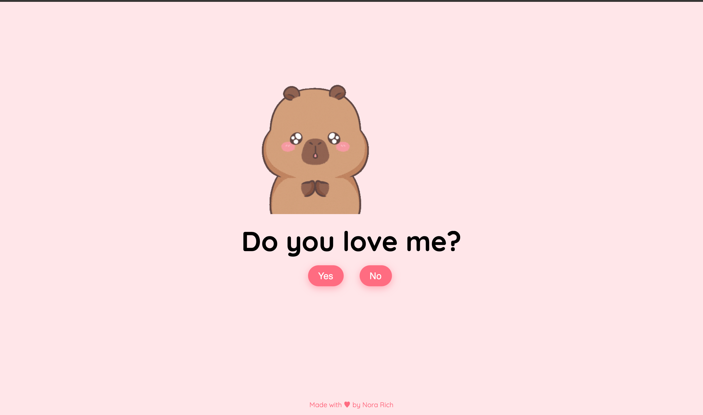

# Capybara Love  
An interactive, fun, and visually appealing front-end project that combines cute animations with a touch of irony! 🌟  

## Screenshot  
  

## Description  
"Capybara Love" is a mini web app that asks an important question: **"Do you love me?"**. Users can answer either "Yes" or "No" and receive a personalized reaction, accompanied by adorable GIFs.  

## Features  
🎨 **Attractive Design**  
🖼️ **Dynamic GIFs**  
💖 **Fully Responsive**  
🛠️ **Easy to Customize**  

## Technologies Used  
- HTML5  
- CSS3  
- JavaScript
